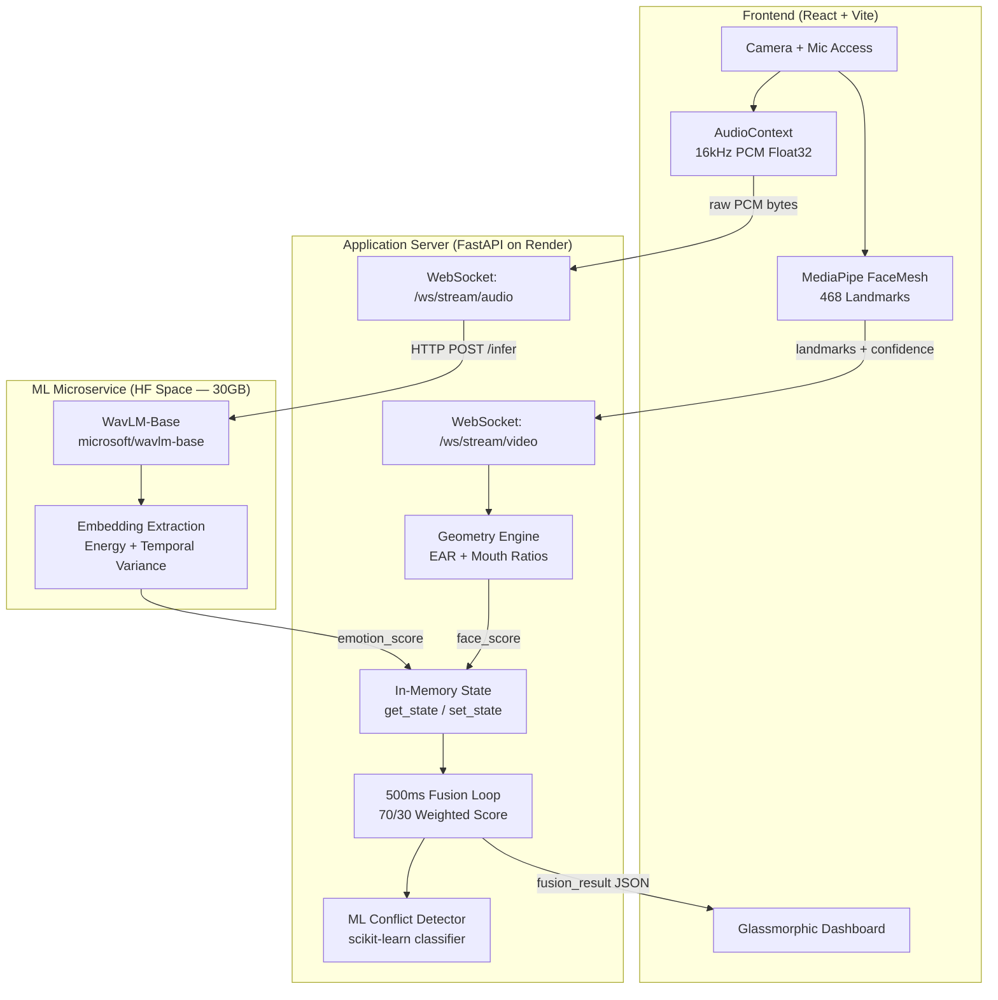

<div align="center">
  <h1>🔮 Aria</h1>
  <p><strong>Real-Time Multimodal Emotion Fusion & Conflict Detection</strong></p>
  <p>A microservice-architected system that fuses acoustic embeddings (WavLM) with real-time facial geometry (MediaPipe) to detect internal emotional conflict — when your face says one thing but your voice says another.</p>

  <p>
    
    
    
    
    
  </p>

  <h3>
    <a href="https://aria-multimodal.vercel.app" target="_blank">🌐 Try the Live Demo</a>
  </h3>
</div>

<br/>

---

## 📖 The Problem

Humans mask emotions constantly. A therapist smiles while describing burnout. A student says "I'm fine" through clenched teeth. Traditional sentiment analysis catches **what** was said but misses **how** it was said — and critically, it misses when the two **contradict** each other.

**Aria** solves this by running two parallel analysis streams in real-time and fusing them to detect emotional conflict:

| Stream | What It Captures | How |
|--------|-----------------|-----|
| 🎤 **Acoustic** (70% weight) | Vocal tone, pitch, energy, jitter | WavLM deep embeddings via HF Space microservice |
| 📹 **Facial** (30% weight) | Eye aspect ratio, mouth geometry, pose | MediaPipe FaceMesh 468-landmark extraction |
| ⚡ **Fusion** | Weighted score + ML conflict detection | scikit-learn classifier on `[audio, face, |diff|]` features |

---

## 🏗️ Architecture: True Microservice Design

This is **not** a monolithic app. Aria implements production-grade microservice separation:

```
Browser → FastAPI (Render) → HF Space (WavLM) → FastAPI (Render) → Browser
```



### Why This Architecture?

- **WavLM is 1.2GB** — offloading to a dedicated 30GB HF Space prevents OOM on the lightweight web server
- **Decoupled inference** — the HF Space has zero knowledge of sessions or fusion logic; it's a pure `/infer` endpoint
- **State abstraction** — `get_state()`/`set_state()` are intentionally behind an interface so Redis can replace in-memory state with a one-line swap for horizontal scaling

---

## ⚡ Key Engineering Decisions

### 1. Graceful Degradation (4 Fusion Modes)
The system never crashes if a modality drops. The 500ms fusion loop dynamically detects staleness (>2s) and low confidence, switching between modes:

| Mode | Condition | Behavior |
|------|-----------|----------|
| `full` | Both streams fresh + face confident | 70/30 weighted fusion + conflict detection |
| `audio_only` | Face stale or low confidence | 100% audio score |
| `face_only` | Audio stale | 100% face score |
| `degraded` | Both stale | Score = 0, waiting for data |

### 2. Browser Tab Visibility API
When the user hides the tab, the frontend sends `{ type: "video_paused" }` — the backend immediately marks face data as stale (timestamp = 0), preventing the fusion loop from using outdated landmarks.

### 3. Face Confidence Scoring
Not all face detections are equal. Aria computes a compound confidence score:
```
confidence = (face_size_score × 0.6) + (head_pose_score × 0.4)
```
Faces that are too small or turned sideways are automatically downweighted below the `FACE_CONFIDENCE_THRESHOLD` (0.6).

### 4. Raw PCM at WavLM's Native Sample Rate
Audio is captured at **16kHz** (WavLM's expected rate) using `ScriptProcessorNode` with 8192-sample buffers (~512ms chunks), matching the fusion loop interval. No resampling artifacts.

---

## ✨ Features

- 🎥 **Real-time video feed** with optional 468-point face mesh HUD overlay
- 🎤 **Live audio waveform** visualization via Web Audio API
- 📊 **30-second rolling timeseries** chart (fused score + conflict)
- ⚠️ **Conflict alert** — visual indicator when face and voice emotions diverge
- 🎛️ **Session stats** — duration, max conflict, data chunks processed
- 🎨 **Glassmorphic dark UI** with Framer Motion animations

---

## 📂 Project Structure

```
aria/
├── backend/                    # FastAPI Application Server
│   ├── app/
│   │   ├── main.py            # WebSocket handlers + fusion loop
│   │   └── core/
│   │       ├── geometry.py    # Facial geometry → emotion score
│   │       └── conflict_model.pkl  # Trained conflict classifier
│   ├── train_conflict_model.py # Training script for conflict detector
│   ├── Dockerfile
│   └── requirements.txt
├── hf_space/                   # ML Inference Microservice
│   ├── app.py                 # WavLM loading + /infer endpoint
│   └── requirements.txt
├── frontend/                   # React + Vite Dashboard
│   └── src/
│       ├── App.jsx            # Main app with WebSocket clients
│       └── App.css            # Glassmorphic design system
└── docker-compose.yml          # Local development orchestrator
```

---

## 🚀 Deployment

### 1. ML Microservice (Hugging Face Spaces)
Deploy `/hf_space` as a HF Space running FastAPI. Exposes `/infer` and `/warmup`.

### 2. Application Backend (Render)
Deploy `/backend` as a Render Web Service.

| Variable | Value |
|----------|-------|
| `HF_INFERENCE_URL` | URL of your deployed HF Space |
| `AUDIO_WEIGHT` | `0.7` |
| `FACE_WEIGHT` | `0.3` |
| `FACE_CONFIDENCE_THRESHOLD` | `0.6` |

### 3. Frontend (Vercel)
Deploy `/frontend` to Vercel. Set `VITE_API_URL` to the Render backend URL.

---

## 🧪 Local Development

```bash
git clone https://github.com/AnkitKumarIISERB/aria-multimodal-analyzer.git
cd aria-multimodal-analyzer

# Option 1: Docker (includes PostgreSQL)
docker compose up --build

# Option 2: Manual
cd backend && pip install -r requirements.txt
uvicorn app.main:app --reload --port 8000

cd ../frontend && npm install && npm run dev
```

---

## ⚠️ Known Limitations

1. **HF Space Cold Starts**: Free-tier HF Spaces sleep after 48h of inactivity. First audio inference may take ~30s while the WavLM model loads.
2. **Facial Geometry Heuristics**: The face emotion score uses geometric ratios (EAR, mouth width) rather than a trained classifier. A production system would use a fine-tuned model on AffectNet/FER2013.
3. **Single-Instance State**: Session state is in-memory Python dicts. Multi-pod Kubernetes deployment would require Redis pub/sub — the `get_state`/`set_state` abstraction makes this a one-line swap.

---

<div align="center">
  <p>Built with 🔮 by Ankit Yadav</p>
</div>
